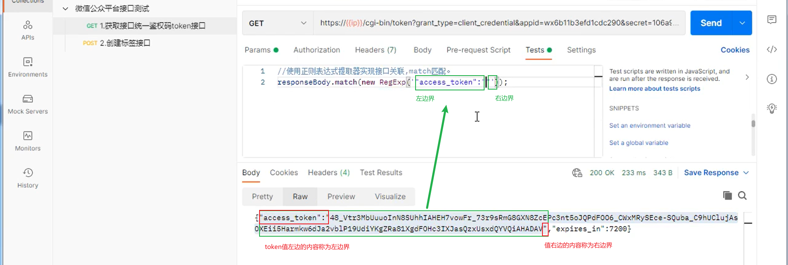
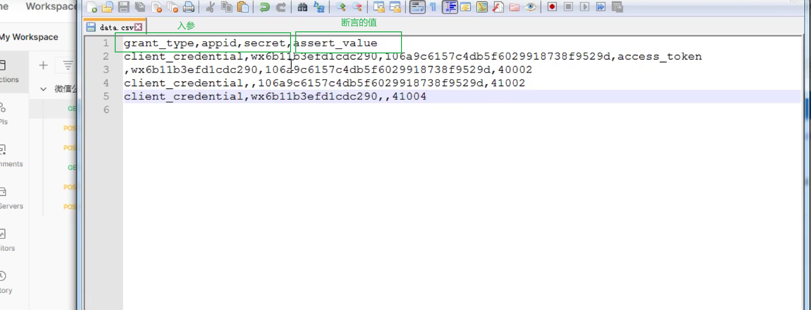
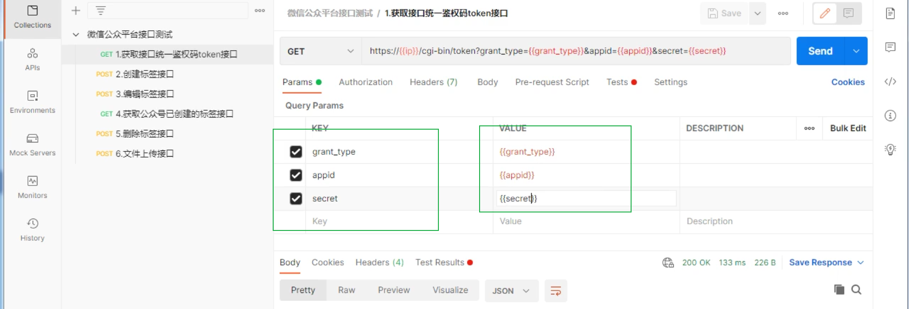
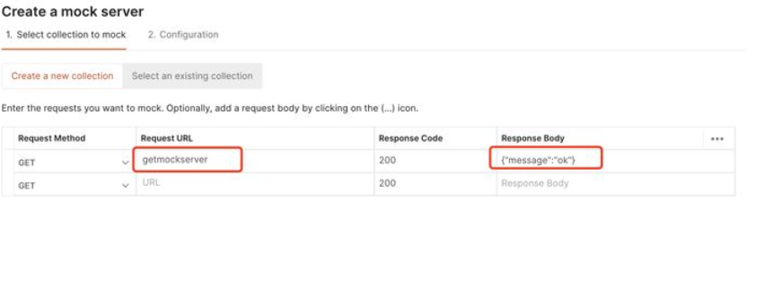
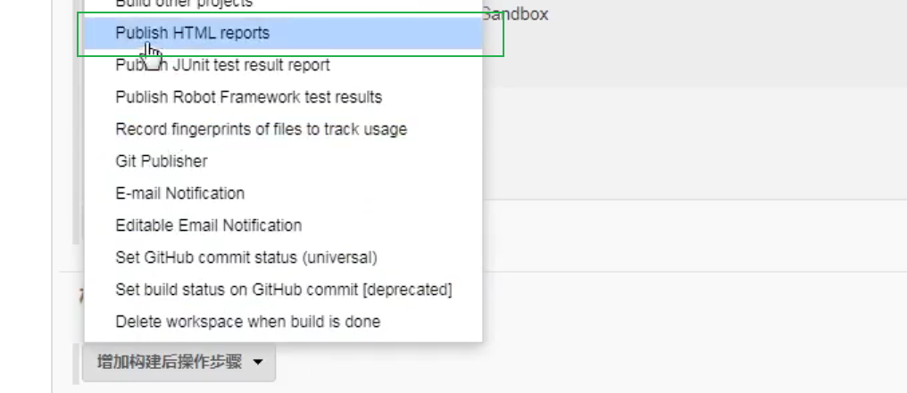

# 


[TOC]


## 接口测试的简介和分类


### 简介


接口测试就是测试系统组件接口之间的一种测试。

### 分类


测试外部接口：被测系统和外部系统之间的接口（只需要测试正例即可）

测试内部接口：

1. 内部接口只提供给内部系统使用（预算系统，承保系统）（只需要正例即可）
2. 内部接口提供给外部系统使用（全面测试，包括正例和异常场景、权限控制等）


## 接口测试的流程以及用例设计


### 接口测试的流程


1.拿到接口api文档（或者跟开发拿/通过抓包工具获取），熟悉接口业务、接口地址、鉴权方式、入参出参、错误码.

2.编写接口用例以及评审

3.使用接口测试用具Postman执行接口测试

4.Postman+Newman+Jenkins实现持续集成，并且输出测试报告发送邮件


### 接口测试用例设计思路


正例： 

​		输入正常入参，接口能否成功返回数据

反例：

​		鉴权反例： 鉴权码为空，鉴权码错误，鉴权码过期，...

​		参数反例： 参数为空，参悟类型异常，参数长度异常。

​		错误码覆盖： 根据业务而定（具体错误码由后端约定）。

​		其他错误场景： 接口黑名单，接口调用次数限制，分页场景。


## Postman界面介绍

### 主页面


home：主页

workspace：工作空间

- Collections: 项目集合
- Apis： api文档
- Enviromments：环境变量，全局变量
- Mock Sever：模拟服务器
- Monitors： 监听器
- History： 历史记录


### 请求页签


Params： get请求传参

authorization：鉴权

headers：请求头

Body： post请求传参

- none： 没有参数
- form-data： 既可以传键值对参数也可以传文件
- x-www-form-urlencoded：只能够传键值对参数
- raw： json,text,xml,javascript
- binary: 把文件以二进制的方式传参

Pre-request-script ：请求之前的脚本

test： 请求之后的断言

cookies： 用于管理cookie信息

 


### 响应页签


Body： 接口返回的数据

- Pretty：以Json,html,xml,...等不同的格式查看返回的数据
- Raw： 以文本的方式查看返回的数据
- Preview： 以网页的方式查看返回的数据

Cookies： 响应的Cookie信息

Headers： 响应头

Test Rerults： 断言的结果

200OK： 状态码

Time： 响应时间

Size： 响应的字节数（678B）


## 面试题


### get请求和post请求的区别


1. get请求一般是获取数据，post请求一般是提交数据；
2. post请求比get请求安全；
3. 本质区别是传参的方式不同：

- get请求在地址栏后面以？连接参数的方式传参，多个参数之间用&分隔；
- post请求实在body以表单的方式传参；


## Postman的环境变量和全局变量


环境变量：只能在某个环境（测试环境/准生产环境/生产环境）下获取的变量；

全局变量：能够在任何接口里面访问的变量；


获取环境变量和全局变量的值： {{变量名}}


## 接口关联


### JSON提取器


在tests（请求之后的脚本）中写入代码

```json
// 第一个接口

//使用Json提取器提取accesss_token的值
// 打印响应体
console.log(responseBody);
// 把返回的字符串形式数据转换成对象
var result = JSON.parse(responseBody);
// 打印返回数据中的token值
console.log(result.accesss_token)
// 设置token为全局变量
pm.globals.set("accesss_token", "result.accesss_token");

// 第二个接口
{{accesss_token}}
```


### 正则表达式提取器


1.使用raw文本格式查看返回的数据，复制所需变量值的左边界和右边界在tests中。



2.匹配值使用.*?代替

```json
// 第一个接口

// 使用正则表达式提取器实现接口关联，match匹配
// new RegExp('') 创建一条正则表达式，表达式内为p匹配值，包含左右边界和值的符号
// （.*?）括号内为要匹配的值使用正则表达式.*?代替
// 返回的结果即为正则表达式，需要的值
// 将返回的正则表达式保存到变量result中
var result = responseBody.match(new ReExp('"access_token":"(.*?)"'));
// 打印result
console.log(result);

```


3.打印正则表达式结果可知下标为1的值是需要的值，将console.log(result)修改为console.log(result[1])


```json
// 第一个接口

// 使用正则表达式提取器实现接口关联，match匹配
// new RegExp('') 创建一条正则表达式，表达式内为p匹配值，包含左右边界和值的符号
// （.*?）括号内为要匹配的值使用正则表达式.*?代替
// 返回的结果即为正则表达式，需要的值
// 将返回的正则表达式保存到变量result中
var result = responseBody.match(new ReExp('"access_token":"(.*?)"'));
// 打印result
console.log(result);
// 设置返回值为全局变量，命名为access_token
pm.globals.set("accesss_token", "result[1]");


// 第二个接口
{{accesss_token}}
```


## Postman内置动态参数以及自定义的动态参数


### Postman内置动态参数


Postman内置动态参数以{{$}}的形式存在，在请求参数后直接加上动态参数即可。

常用内置动态参数：

- {{$timestamp}}:生成当前时间的时间戳

- {{$randomlnt}}:生成0-1000之间的随机数

- {{$guid}}:生成速记GUID字符串


### 自定义动态参数


在Pre-request Script中自定义动态参数并设置为全局变量，之后使用{{变量名}}加在请求参数后即可。

```json
// 手动获得时间戳
var times = Date.now();
// 设置为全局变量，命名为time
pm.globals.set("time", times);
```

 	


## Postman断言


一般断言分为状态断言和业务断言。Test页签中支持JS语法，如果响应数据为Json格式，需要将响应数据转化为Json对象（Postman解析）再获取响应数据。

**注意：**状态断言只能有1个，业务断言可以有多个。

### 六种常规断言

==status code:Code is 200 检查返回的状态码是否为200==

==Response body：Contains string 检查响应中包含指定字符串==

==Response body：Json value check 检查响应中的json的值==

==Response body：is equal to a sting 检查响应等于一个字符串==

Response body：Content-Type header check 检查相应是否包含响应头Content-Type

Response time is less than 200ms：检查请求耗时小于200ms


### 自定义参数断言

自定义动态参数即为全局变量，在需要使用的位置获取自定义动态参数（全局变量）即可。

使用自定义参数的方式：

1. 使用Get a grobal variable断言获取全局变量， pm.globals("变量名")

2. globals["变量名"]

3. globals.变量名


### 全局断言

全局断言会自动在接口执行时添加到每个接口的断言中。

设置方法：项目集的Edit - > Tests 


## Postman批量执行接口调用

项目集>>Run colletion


**注意：**如果在执行接口时需要批量上传文件，需要在设置中打开【允许上传工作路径上的文件】开关


## Postman数据驱动CSV文件或JSON文件


做api测试的时候同一个接口会使用大量的数据（正常流/异常流）去验证，如果一种场景写一个接口的话相对麻烦，此时可以使用数据驱动来实现。


### CSV文件驱动


本地创建csv文件，第一行写上字段名（key），多个字段用逗号隔开。从第二行开始写上值（value），不同值之间用逗号隔开。如果有设置的断言内容，也设置变量将断言字段写在第一行。注意：不能有空格、空行。



在postman中value的值使用{{变量名}}（csv文件里面的字段），断言中取文件里的字段名。



打开runner，导入csv文件即可。


### JSON文件驱动

设置环境变量（设置环境变量是设置key还是value？？？一博客说是设置key但{{value}}）

创建json文件，实现变量参数化。多参数或多条用例用逗号隔开，格式为：[{key1:value1-1,key2:value2-1...},{key1:value1-2,key2:value2-2...},...]

[

{"name" : "python","id" : "90"},{"name" : "php","id" : "91"},{"name" : "java","id" : "91"}

]

csv文件和Json文件数据驱动只是数据格式不一致，其他操作一致。


## 测试必须带请求头的接口


测试接口需要哪些必须的请求头时可以抓包将接口的请求头复制到Headers>>Bulk Edit。

### 常见的请求头

Host：请求的主机地址

Connection：连接方式

==Accept：客户端接收到的数据格式==

==X-Requestrd-With：异步请求==

==User-Agent：客户端的用户类型==

Referer：来源

==Cookie：Cookie信息==

==Content-Type：请求内容的格式==


## Postman接口Mock Server服务器


为了不影响前端开发的进度，一般后端都是先定数据结构，然后写个假接口让前端调用，这样前端就不必等着后端接口开发完成以后再开始了。postman mock server功能，可以帮助前后端团队在约定了API接口之后，各自完成开发，不受收到对方进度的影响。

创建mock server，输入接口URL和返回的数据，再编辑接口名称即可。返回到Collection中可以看到Mocks下创建的server。postman会自动将url设置为环境变量，执行时需要切换环境变量。





## Postman中cookie的鉴权方式


cookie：cookie是一小段文本，格式为key：value。


cookie鉴权的原理：

1. 当客户端第一次访问服务器的时候，服务器就会生成cookie信息并在响应头的set-cookie里面把生成的cookie信息发送给客户端。
2. 当客户端第2-N次访问服务器的时候，客户端就会在请求头的cookie带上cookie信息，从而实现鉴权。


cookie的分类：

- 会话cookie：保存在内存，当浏览器关闭之后就会自动清楚cookie。
- 持久cookie：保存在硬盘，浏览器关闭后不会清楚，只有当失效时间到了才会自动清除。


postman鉴权的方式：postman会在第一次访问服务器的时候自动保存cookie信息，在下游接口自动带上cookie信息。

如果在下游接口中执行失败或者获取到的数据是旧数据，可以清楚所有cookie信息后，重新在上游接口访问服务器。


## Postman+Newman


Postman是专为接口测试而生的，newman是专为postman而生的。newman可以让postman脚本通过非GUI（图形用户界面），即命令行的方式运行。Newman 可以方便地运行和测试集合，并用之构造接口自动化测试和持续集成。


### newman安装


1. 先安装node.js，下载地址：https://nodejs.org/en/  ，双击后根据提示下一步安装完成
2. 验证node，npm安装，命令行分别输入：node -v ，npm -v
3. 输入命令安装newman： npm install -g newman 进行安装，然后 newman -v 检查
4. 生成html报告要先安装html套件，命令行执行： npm install -g newman-reporter-html
5. 使用htmlextra套件可以生成比较高级的html报告，使用方法和html相同，需要安装htmlextrea，命令行输入npm install -g newman-reporter-htmlextra
6. 把postman脚本通过集合导出，包括环境变量、全局变量和驱动数据都可以导出，保存成Json格式


### Postman+Newman的使用


运行命令：newman run

常用参数：

-e 引用环境变量(跟环境变量文件,如： -e enviroment.json)

-g 引用全局变量(跟全局变量文件,如： -g global.json)

-d 引用数据文件（跟驱动数据文件,如：-d data.json）

-n 指定测试用例迭代的次数

-r cli,html,json,junit --reporter-html-export 指定生成html报告（跟生成报告文件,如：-r cli,html,json,junit --reporter-html-export report.html）

-r cli,html,json,junit --reporter-json-export 指定生成json报告

-r cli,html,json,junit --reporter-junit-export 指定生成junit报告

-r cli,html,json,junit --reporter-cli-export 指定生成cli报告

（默认生成的报告保存在当前目录下，如果文件名前加上路径，则保存在指定的目录下）

命令行（当前文件夹）：newman run testcase.json -e enviroment.json -g global.json -d data.json -n 10 -r cli,html,json,junit --reporter-html-export report.html


## Postman+Newman+Jenkins持续集成


postman基于JavaScript语言，postman的脚本（json文档）运行依赖于newman环境，而newman环境依赖于JavaScript的环境nodejs。

jenkins只支持windows命令行和Linux shell环境执行构建命令，postman的脚本不能直接在windows命令行和shell环境执行，需要依赖于newman环境，而newman环境依赖于JavaScript的环境nodejs。因此，整个过程是先搭建nodejs构造JavaScript环境，再搭建newman环境构建postman脚本运行环境，最后集成到Jenkins上。


### Jenkins安装步骤


1.安装Tomcat，下载地址：https://tomcat.apache.org/download-90.cgi

2.安装Jenkins，将Jenkins安装在Tomcat的webapps目录下。Jenkins官方网站：https://jenkins.io/

3.Jenkins安装完成后，等待安装主流插件。

4.jenkins安裝成功后，本地浏览器输入：http://localhost:8080

5.用户账号设置，默认是admin，账号密码根据提示在安装路径的initialAdminPassword文件中可找到，如安装路径E:\Jenkins2.150.1\secrets\initialAdminPassword即可找到；也可自己设置账号密码。

6.插件配置：JDK、Git、Maven等


### Postman+Newman+Jenkins


Jenkins服务器开启停止命令：

（1）停止:net stop jenkins

（2）启动:net start Jenkins


1. 新建一个项目

2. 设置Freestyle project（自定义工作空间）

配置》》高级》》使用自定义的工作空间，选择脚本文件夹路径作为工作目录


3. 【构建】选择Execute Windows batch command（执行windows的批处理命令）


输入Newman中的运行json文档命令、生成报告的命令:


4. 执行系统的Groovy脚本

默认情况下查看Jenkins中html报告的样式会丢失，执行Groovy脚本后可以保证样式不丢失。


增加构建后的操作





5. 生成的HTML报告集成到Jenkins


运行


