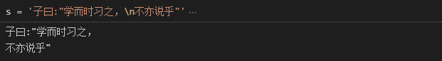
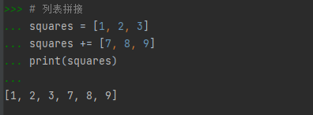
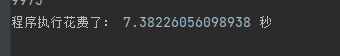

[toc]


## 基础语法

### 注释

python单行注释以#开头，习惯上#后会跟一个空格。多行注释可以用多个# 还有 ''' *注释内容*'''  和 """ *注释内容*""" ：

~~~python
#第一个注释
print("Hello,Python!")#放在后面的注释不影响代码
~~~

```python
#多行注释
'''
第一个注释
第二个注释
第三个注释
'''
print("Hello,Python!")
```

执行以上代码，输出结果为：


### 行与缩进

python使用缩进来表示代码块，不需要使用大括号{}。缩进空格数可变，但同一个代码块所用缩进空格数必须一致。

```python
#缩进空格数相同
if true:
    print("1")
else:
    print("0")
```

执行以上代码，输出结果为：


如果缩进空格数不一致则会报错：

```python
if True:
  print("1")
  print("true")
else:
print("0")#缩进空格不一致
 print("false")
```

执行以上代码，输出结果为：


### 多行语句

Python通常一行写完一条语句，以换行结束[^其他语言如Java以分号结束]。当语句过长时可以使用反斜杠\实现多行语句。

```python
total = item_one + \
        item_two + \
        item_three
```

在[],{}或者()中的多行语句，不需要使用反斜杠\。

```python
total = ['item_one','item_two','item_three','item_four','item_five','item_six']
```


### print()输出

print()默认输出是换行的，如果要实现不换行需要在变量末尾加上==end=''==。

```python
a = 0
b = 1
# 换行输出
print(a)
print(b)
# 不换行输出
print(a, end='')
print(b, end='')
```


### import与from...import

引入模块可以对Python进行扩展，在python中用import 或者from...import导入相应的模块。

将整个模块导入，格式为:import  somemodule

将整个模块的全部**函数**导入,格式为：from   somemodule  import  *

从某个模块导入某个函数，格式为：from somemodule import  onefunction

从某个模块导入多个函数，格式为：from somemodule import  firstfunc, secondfunc, thirdfunc


## 数据类型

#### 简介

Python中的变量不需要声明。每个变量在使用前都必须赋值，变量赋值后才会被创建。在Python中，变量就是变量，它没有类型。数据类型是变量所指的内存中对象的类型。


Python3中有六个标准的数据类型：

- Number(数字)
- String（字符串）
- List（列表）
- Tuple（元组）
- Set（集合）
- Dictionary（字典）

不可变数据：Number、String、Tuple;

可变数据：List、Dictionary、Set.

序列是Python中最基本的数据结构。

序列中的每个值都有对应的位置值，称之为索引。从左到右第一个索引是0，第二个是1，以此类推。Python中最常见的数据类型是列表和元组，可以进行的操作包括索引、切片、加、乘、检查成员。此外，Python已经内置确定序列长度以及最大最小元素的方法。


### 数字（Number）类型

Python中数字有四种类型：整数、布尔型、浮点型和复数。

- int(整数)，如1，在python中所有的整数都是int类型，没有long[^python2中有长整型]。如果数字长度过大可以使用下划线__作为分隔符。通过运算符运算时可以保证整数运算精确。其他进制的整数打印出来一定是十进制数字：

  ```python
  print(100_100_100)
  ```

  执行以上代码，输出结果为：

  

    

  1. 二进制以0b开头

     ```python
     a = 0b10
     print(a)
     ```

     执行以上代码，输出结果为：

  2. 八进制以0o开头

  3. 十六进制以0x开头

- bool(布尔型)，True和false

- float(浮点数)，如1.23 、3E-2。对浮点数进行运算可能会得到一个不精确的结果[^所有编程语言都一样]，可以通过一些模块进行但不能直接运算浮点数。

  ```python
  b = 0.1 + 0.2
  print(b)
  ```

  执行以上代码，输出结果为：

  

- complex(复数)，如1+2j、1.1+2.2j

### 字符串(String)

字符串用来表示一段文本信息，在Python中需要使用引号把字符串引起来，Python中单引号'和双引号"使用完全相同,但是不能混用[^1]。python中严格区分大小写。

```python
s = 'Hello'
print(s)
```

执行以上代码，输出结果为：

#### 引号嵌套

相同的引号之间不能嵌套[^2],不同的引号之间可以嵌套。

```python
s = '子曰："学而时习之，不亦说乎"'
print(s)
```

执行以上代码，输出结果为：

#### 指定多行

使用三引号（'''或"""）可以指定多行字符串，并且会保留字符串中的格式。

```python
s = '''锄禾日当午，
汗滴禾下土。
谁知盘中餐，
粒粒皆辛苦。'''
print(s)
```

执行以上代码，输出结果为：


#### 索引和截取

字符串截取的语法：变量[*头下标（索引）*:*尾下标（截取）*]

索引值以0从左边开始，-1为从末尾开始位置。截取值可理解为按字符中的间隔从1开始，-1为从末尾开始位置。字符串的截取可理解为包含 索引值-截取值前面一位。因此截取的字符串最大比原字符串小一位（~~要截取所有字符直接输出字符串就好了~~）。


```python
a = 'hello world'
print(a[0:6])  # 截取第一个到第六个字符：hello （空格也算）
print(a[2:-2])  # 截取第三个到倒数第三个字符：hello wor
print(a[0])  # 截取第一个字符：h
print(a[1:])  # 截取第二个后的全部字符：ello world
```

以上代码运行结果为：


#### 转义符

\ 可以在字符串中使用一些特殊的内容。

- \\'表示没有指定字符串的单引号'
- \\"表示没有指定字符串的单引号"
- \t表示制表符，相当于tab键
- \n表示换行符dhasjkdhjaksdhjksa
- \\\\表示反转义，两个\才能打出一个\

```python
s = '子曰："学而时习之，\n不亦说乎"'
print(s)
```

执行以上代码，输出结果为：

反斜杠\可以用来转义，试用r可以让反斜杠不发生转义。 如 **r"this is a line with \n"** 则 **\n** 会显示，并不是换行。

[^1]: s = 'hello "
[^2]: s = "子曰："hello" "

#### 格式化字符串

##### 1.传统方法格式化字符串

字符串之间也可以进行加法运算，如果将两个字符串进行相加，则会自动将两个字符串拼接成一个。

```python
a = 'abc' + 'hhhh' + '666'
print('a='+a)
'''这种写法在python中不常见，因为字符串不能和其他类型进行加法运算'''
```

```python
a = 123
print('a=',a)
'''通过传两个参数来格式化信息，字符串可以和其他类型进行拼接'''
```

执行以上代码，输出结果为：


##### 2.占位符方法格式化字符串

在创建字符串时，可以在字符串中指定占位符s（string）、f(float)。

- %s在字符串中表示任意字符。语法为 '*字符串* %s' % '*填充占位符的字符串*'。
- 指定占位符最小字符位数语法为 '*字符串* %n[^3]s' % '*填充占位符的字符串*'，如果不够则空格补位。
- 指定占位符字符位数区间语法为 '*字符串* %n.m[^4]s' % '*填充占位符的字符串*'，如3.5表示字符数在3-5之间，不足3用空格补位，多于5个部分不展示。
- %s无法指定小数的位数，只能通过浮点数占位符%f实现。格式化浮点数字，可以通过%.mf指定小数点后的精度。
- %d 整数占位符

```python
#指定单个占位符
b = 'hello %s'%'孙悟空'
print(b)
#指定多个占位符
c = 'hello %s 你好 %s'%('tom','孙悟空')
print(c)
#指定占位符最小字符位数
d = 'hello %3s'%'abcde'
print(d)
#占位不够最小字符数时空格补位
e = 'hello %5s'%'abc'
print(e)
#占位字符数区间
f = 'hello %3.5s'%'abcdefg'
print(e)
#指定占位符最大字符位数
g = 'hello %3s'%'abcde'
print(g)
#%f指定小数的位数
h = 'hello %.3f'%123.45678#其他数据类型无需引号
print(h)#浮点数结果为四舍五入
#整数占位符
i = 'hello %d'%123.123
print(i)#结果直接舍去小数，无四舍五入

#综上格式化字符串可以选择：
a = 123
print('a = %s'%a)
```

执行以上代码，输出结果为：


##### 3.f-string方法格式化字符串

f-sting是python3.6之后版本添加的，称之为字面量格式化字符串，是新的格式化字符串语法，之前更习惯用百分号（%）。

f-srting格式化字符串以f开头，后面跟着字符串，字符串中的表达式或变量用大括号{}包起来，它会将变量或表达式计算后的值替换进去。

用了这种方式明显更简单了，不用再去判断使用 %s，还是 %d。

```python
a = '123'
b = '六儿'
c = f'hello {a}{b}'
print(f'c= {c}')
print(f'a= {a}')
```

以上代码执行结果为：


#### Unicode 字符串

在Python2中，普通字符串是以8位ASCII码进行存储的，而Unicode字符串则存储为16位unicode字符串，这样能够表示更多的字符集。使用的语法是在字符串前面加上前缀 **u**。

在Python3中，所有的字符串都是Unicode字符串。

#### 4.练习

```python
# 练习：创建变量保存名字，使用四种方式输出，欢迎xxx光临
name = '李4'
#拼串
print('欢迎'+name+'光临!')
#多个参数
print('欢迎',name,'光临！')
#占位符
print('欢迎%s光临！'%name1)
#格式化字符串
print(f'欢迎{name}光临！')
```

以上代码运行结果为：

[^3]: n为任意整数,如3
[^4]: nm为任意整数，如3.5


#### 复制字符串

 复制字符串可将字符串和数字相乘[^5]，解释器会将字符串重复指定字数并返回。

```python
a = 'abc'
a = a*20
print(a)
```

以上代码运行结果为：

[^5]: *表示乘法


### 列表

列表是最常用的Python数据类型，它可以作为一个方括号内的逗号分隔值出现。

元素（数据项）不需要具有相同的类型。

创建一个列表，只需要把逗号分隔的不同的数据项使用方括号括起来即可。

```python
list1 = ['如果可以作弊', '我会想你念你', 1,2,3]
print(list1)
```

以上代码运行结果为：


#### 列表索引

与字符串索引一样，列表索引从0开始，第二个索引是1，依次类推，通过列表可以进行截取、组合等操作。


索引也可以从尾部开始，最后一个元素为-1，倒数第二个为-2.以此类推。


```python
list2 = ['我', '曾将', '青春', '翻涌', '成', '她']
print(list2[1])  # 曾将
print(list2[-1])  # 成
```

以上代码运行结果为：


#### 列表截取

与截取字符串一样，可以使用[]的形式截取字符。


```python
nums = [10, 20, 30, 40, 50, 60, 70, 80]
print(nums[2:7])  # 30,40,50,60,70
print(nums[1:-2])  # 20,30,40,50,60
```

以上代码运行结果为：


#### 更新列表

可以对列表的数据线进行修改或更新

```python
list3 = ['如果可以作弊', '我会想你念你', 1, 2, 3]
list3[2] = '到最后的荼蘼'
print(list3)
```

以上代码运行结果为：


使用append() 方法可以在列表末尾添加新的对象。

```python
list3 = ['如果可以作弊', '我会想你念你', 1, 2, 3]
list3.append('到最后的荼蘼')
print(list3)
```

以上代码运行结果为：


#### 删除元素

语法： del  list[3]  # 删除列表第三个元素

```python
list3 = ['如果可以作弊', '我会想你念你', 1, 2, 3]
list3.append('到最后的荼蘼')
del list3[3]
print(list3)
```

以上代码运行结果为：


#### 列表拼接

多个列表直接相加可以实现列表拼接。

```python
# 列表拼接
squares = [1, 2, 3]
squares += [7, 8, 9]
print(squares)
```

以上代码运行结果为：




#### 列表嵌套

使用嵌套列表即在列表里创建其他列表。语法：list = [list1,list2]

嵌套后列表索引子表语法为：list[0]  #索引第一个表

嵌套后列表索引子表的元素语法为： list[0]\[1]  # 索引第一个表第二个元素。

```python
# 嵌套列表
a = ['a', 'b', 'c']
n = [1, 2, 3]
list = [a, n]
print(list)
# 索引子表
print(list[0])  # ['a', 'b', 'c']
# 索引子表的元素
print(list[0][1])  # b
```

以上代码运行结果为：


### 元组

#### 简介

Python的元组与列表类似，不同之处在于元组的元素不能修改、删除。

元组使用小括号==（）==，列表使用中括号==[ ]==。

#### 创建元组

创建元组只需要在括号中添加元素，并用逗号隔开即可。

```python
# 创建元组
tuple = ('Google', 'Runoob', 1997, 2000)
tup1 = (1, 2, 3, 4, 5)
tup2 = 3,  5, 6  # 不用小括号也可以
tup3 = ()
print(type(tuple))
print(type(tup1))
print(type(tup2))
print(tup1)
print(tup2)
print(tup3)
```

以上代码运行结果为：


元组只包含一个元素是，需要在元素后面添加逗号==,==  ，否则括号会被当做运算符使用。

```python
tup1 = (50)
tup2 = (50,)
print(type(tup1))
print(type(tup2))
```

以上代码运行结果为：


#### 元组索引和截取

元组与字符串相似，下标索引从0开始，可以进行截取组合等。


```python
tup1 = (10, 20, 30, 40, 50, 60)
print(tup1[0])  # 10
print(tup1[1:5])  # (20, 30, 40 ,50)
print(tup1[2:-1])  # ( 30, 40, 50)
```

以上代码运行结果为：


#### 元组的拼接、修改、删除

元组类似字符串和表格可以进行拼接。

```python
tup1 = ('a', 'b', 'c')
tup2 = (1, 2, 3)
tup3 = tup1 + tup2
print(tup3)
```

以上代码运行结果为：


元组的元素不可改变，因此不允许修改。

```python
tup1  = (1, 2, 3)
tup1[0] = 100  # 该操作是非法的
```


元组的元素不可改变，因此也不能单个删除，但可以使用del语句删除整个元组。

```python
tup1 = (1, 2, 3)
del tup1
print(tup1)
```

以上代码运行结果为：


#### 关于元组不可变

所谓元组的不可变指的是元组锁指向的内存中的内容不可变。

```python
# 以下代码中可以看出重新赋值的元组tup1绑定到新的对象了，不是修改原来的对象。
tup1 = (1, 2, 3)
print(id(tup1))
tup1 = ('a', 'b', 'c')
print(id(tup1))
```

以上代码运行结果为：


### 字典

#### 简介

字典是另一种可变容器模型，且可存储任意类型对象。

字典的每个键值对==key=》value==用冒号==：==分割，每对之间用逗号==,==分割，整个字典包括在花括号=={}==中，语法为：dict = {key1 : value1, key2 : value2, key3 : value3}

**注意**: ==dict==作为Python的关键字和内置函数，变量名不建议命名为dict。


键必须是唯一的，但值不必。

键必须是不可变的数据类型，如数字、字符串，值可以取任何数据类型。


#### 创建字典

语法： dict = { key1 : value1, key2 : value2, key3 : value3}

```python
tinydict = {'a': 1, 'b': 2, 'c': 3}  # 创建字典
emptydict = {}  # 创建关键空字典
print(tinydict)  # 打印字典
print(emptydict)
print('length=', len(tinydict))  # 查看字典类型
print('length=', len(emptydict))
print(type(tinydict))  # 查看类型
```

以上代码运行结果为：


#### 访问字典的值

字典访问与前面类似，不同的是字典访问只需要把对应的键放入中括号中。语法： dict[key1]. 

如果访问字典中没有的键则会报错。

```python
tinydict = {'Name': '大傻春', 'Age': 2, 'Class': '你要干什么'}
print(tinydict['Name'])
print(tinydict['Class'])
```

以上代码运行结果为：


#### 字典的新增、修改

字典中添加新内容的方法是增加新的键值对，语法：dict[new key] = new value.

同样对键值对赋值也可以修改已有键值对。语法： dict[key1] = new value

```python
tinydict = {'Name': '大傻春', 'Age': 2, 'Class': '你要干什么'}
tinydict['Age'] = '你个大傻子'  # 更新Age
tinydict['Word'] = '滚就滚'  # 添加Word信息
print(tinydict['Word'])
print(tinydict)
```

以上代码运行结果为：


#### 删除字典元素

删除单一的元素，语法为：del  dict[ key1].

清空字典，语法为：dict.clear().

```python
tinydict = {'Name': '大傻春', 'Age': 2, 'Class': '你要干什么', 'Word': '滚就滚'}
del(tinydict['Age'], tinydict['Word'])  # 删除字										典中的元素
print(tinydict)
tinydict.clear()  # 清空字典
print(tinydict)
```

以上代码运行结果为：


显式删除一个字典，语法为：del dict.但会引发一个异常，因为执行del操作后字典不再存在。

```python
tinydict = {'a': 1, 'b': 2, 'c': 3}
del tinydict
print(tinydict)
```

以上代码运行结果为：


#### 字典键的特性

字典值可以是任何的python对象，既可以是标准的对象，也可以是用户定义的对象，但键不允许。

1. 不允许同一个键被赋值两次，创建时如果同一个键被赋值两次，后一个值会被记住。

```python
tinydict = {'a': 1, 'b': 2, 'c': 3}
tinydict['b'] = 30
print(tinydict)
```

以上代码运行结果为：


2. 键必须不可变，因此可以用数字、字符串、元组充当，其他可变数据类型就不行。

```python
tinydict = {[a]: 1, 'b': 2, 'c': 3}
print(tinydict)
```

以上代码运行结果为：


### 集合

#### 简介

集合（set）是一个无序的不重复元素序列。

可以使用大括号=={ }== 或者==set（）==函数创建集合，**注意**：创建一个空集合必须用==set（）==而不是=={  }==，因为=={ }==是用来创建一个空字典的。


### 布尔值和空值

#### 布尔值（boolean）

布尔值（bool）主要用来做逻辑判断，实际上也属于整型。True表示 真，相当于1。False表示 假，相当于0。

```python
a = True
print('a = ',a)
#布尔值属于整型
print(1+False)
```

以上代码运行结果为：

#### 空值（None）

None专门用来表示不存在。

```python
c = None
print(c)
```

以上代码运行结果为：


### 类型检查

通过类型检查可以检查指定值或变量对应值的类型。使用type（）函数检查值的类型,该函数会将检查结果作为返回值返回，可以指定变量来接收函数的返回值。

```python
#类型检查实例
a = 123 # 数值
b = '123' # 字符串
# print('a = ',a)
# print('b = ',b)
# 输出结果一致
type(123)
c  = type(123)
# 此处也可以c = type(a)直接检查变量a的数据类型
print(c)
# 此处也可以直接 print(type(b))
```

```python
a = 123 
b = '123' 
# 方式一
type(123)
c  = type(123)
print(c)
# 方式二
d = type(a)
print(d)
# 方式三
print(type(b))
```

以上代码运行结果为：


```python
print(type(1))
print(type(1.5))
print(type(True))
print(type('hello'))
print(type(None))
```

以上代码运行结果为：


### 面向对象

Python是一门面向对象（object）的语言。一切皆是对象。程序运行当中所有的数据都是存储到内存中再运行的。对象就是内存中专门用来存储指定数据的一块区域，实际上对象就是一个容器，专门用来存储数据。数值、字符串、布尔值、None都是对象。

### 对象的结构

每个对象都要保存三种数据：

- id（标识）:用来标识对象的唯一性，每个对象都有唯一的id。可类比为人的身份证号。

  可以通过id（）查看对象的id，id是由解析器生产的，在CPython中，id就是对象的内存地址。 对象一旦创建，id就不会再改变。

  ```python
  id(123)
  ```

  以上代码运行结果为：

  

- type（类型）：用来表示当前对象所属的类型，比如：int str float bool... 类型决定了对象的功能。通过type()函数来查看对象的类型。Python是一门强类型语言，对象一旦创建，类型就不会再改变。

- value（值）：值就是对象中存储的具体数据。可变对象的值是可以改变的，不可变对象（之前学过的所有对象）的值不可改变。

### 变量和对象

对象并没有直接存储到变量中，在Python中变量更像给对象起了一个别名。例如a = 123不能理解为将对象123存储到变量中，而是给123起了一个别名为a。

变量中存储的不是对象的值，而是对象的id（内存地址）。当我们使用变量时，实际上是通过对象的id查找对象。

```python
# 变量a的值为对象123的id
id（123） # id为140718025667216
a = 123
id(a) # id同样为140718025667216
b = a # b指向a的值（123的id）
id(b) # id同样为140718025667216
```

以上代码运行结果为：


变量中保存的对象（id），只有在为变量重新赋值时才会改变。变量和变量之间是相互独立的，修改一个变量不会影响另一个变量。

```python
a = 10
b = a # 此时b指向a的值，即为对象10的id
print(b) 
a = 20 # 此时a指向对象20的id
print(a,b) #a改变，b不受影响
```

以上代码运行结果为：


### 类型转换

所谓的类型转换就是将一个类型的对象转换为其他对象。类型转换不是改变对象本身的类型，而是根据当前对象的值创建一个新的对象。

类型转换的四个函数 int()  float()  str()  bool()

int()可以用来将其他的对象转换为整型。

int()函数的规则：

- 布尔值：True->1        False-> 0
- 浮点数:直接取整，省略小数点后的内容。
- 字符串：合法的整数字符串直接转换为对应的数字，如'123456'，否则报错。
- 对于其他不可转换为整型的对象，如None，则直接抛出异常。

```python
# 定义一个变量a的类型
a = True
print('a = ',a)
print('a的类型为',type(a))
```

以上代码运行结果为：


int()函数不会对原来的变量产生影响，他是将对象转换为指定的类型并将其作为返回值返回。如果希望修改原来的变量，则需要对变量进行重新赋值。

```python
a = True
# int(a)  若执行结果a仍为bool，不会产生影响
a = int(a) # 重新赋值a
print('a = ',a)
print('a的类型为',type(a))
```

以上代码运行结果为：


float()和int()基本一致，不同的是它会将对象转化成float。

str()可以将对象直接转换成字符串。

```python
# 需要字符串和其他类型拼串时
b = 123
print('hello',str(b))
```

以上代码运行结果为：


bool()可以将对象转换为布尔值，任何对象都可以转换为布尔值。规则：对于所有表示空性[^6]的对象转换为False，其余转换为True。

[^6]: 例如：0、None、' ' ......


## 运算符（操作符）

运算符可以对一个或多个值进行运算或各种操作。

运算符的分类：

- 算数运算符
- 赋值运算符
- 关系运算符（比较运算符）
- 逻辑运算符
- 条件运算符（三元运算符）

### 算术运算符

浮点数做运算时，结果仍返回一个浮点数。

##### 加法运算符（+）

直接进行加法运算。如果是两个字符串之间进行加法运算，则会直接进行拼串。

```python
a = 10 + 5
print('a =',a) # 计算
b = 'hello' + 'world' # 拼串
print('b =',b)
```

以上代码运行结果为：


##### 减法运算符（-）

可以对数字进行减法运算，但不能字符串之间相减。

##### 乘法运算符（*）

可以对数字进行乘法运算。如果将字符串和数字相乘，则会对字符串进行复制操作，重复指定的次数。幂运算（**）可以求一个值的几次幂，也可以求开方。

```python
a = 2**3
print('a = ',a)
b = 16**0.5 # 求开方
print('b = ',b)
```

以上代码运行结果为：


##### 除法运算符（/）

可以对数字进行除法运算，运算时结果总会返回一个不精确的浮点值。整除(//)只会保留计算后的整数。

```python
a = 10 / 3
print('a = ',a)
b =10 // 3 # 整除
print('b = ',b)
```

以上代码运算结果为：


取模：求两个数相除的余数

```python
a = 10 % 5
print('a = ',a)
b = 10 % 4
print('b = ',b)
c = 10 % 3
print('c = ',c)
d = 10 % 2
print('d = ',d)
```

以上代码运行结果为：


### 赋值运算符

Python允许为多个变量赋值，例如：

```python
a = b = c = 1
a,b,c = 1, 2, 'runoob'
```


= :赋值运算符可以将等号右侧的值赋值给左侧的变量。

+=: a += 5 相当于a = a + 5

-=: a -= 5 相当于a = a - 5

*=: a *= 5 相当于a = a * 5

\*\*=: a \*\*= 5 相当于a = a ** 5

/=: a /= 5 相当于a = a / 5

//=: a //= 5 相当于a = a // 5

%=: a %= 5 相当于a = a % 5

+=: a += 5 相当于a = a + 5

+=: a += 5 相当于a = a + 5

+=: a += 5 相当于a = a + 5

```python
a = 10 # 赋值
a += 5 # 15
a -= 5 # 10
a *= 5 # 50
a **= 5 # 312500000
a /= 5 # 62500000
a //= 5 # 12500000
a %= 5 # 0
print(a)
```

### 关系运算符（比较运算符）

用来比较两个值之间的关系，总会返回一个布尔值。如果关系成立，返回True，否则返回False。

- \> 比较左侧值是否大于右侧值
- \>= 比较左侧值是否大于或等于右侧值
- \< 比较左侧值是否小于右侧值
- \<= 比较左侧值是否小于或等于右侧值
- \== 比较两个对象的值是否相等
- \!= 比较两个对象的值是否不相等
- is 比较两个对象是否为同一个对象，比较的是对象的id
- is not 比较两个对象是否不是同一个对象，比较的是对象的id

```python
10 > 20 # False
result = 10 > 30 # False
result = 30 > 20 # True
result = 10 >= 20 # True
result = 2 >= True # True
# result = 2 >= '1' # 报错，数字不能与字符串比较

# 相等和不等比较的是对象的值而不是id
result = 1 == 1 # True
result = 'abc' == 'bcd' # False
result = 'abc' != 'bcd' # True
result = 1 is True # False:不是同一个id
result = 'qqq' is not 'aaa' # True
print('result = ',result)
```

在Python中可以对两个字符串进行大于（等于）或小于（等于）的运算，当对字符串进行比较时，实际上比较的是字符串的Unicode编码。

比较字符串的Unicode编码时，是逐位比较的。例如比较abc和def，a->d  b->e  c->f 。第一位相等时，比较第二位，第二位相等时比较第三位，以此类推。若前位比较已有结果则后位不予比较，直接出结果。利用该特性可以对·······字符串按照字母顺序进行排序，但是对于中文意义不大。

```python
result = 'a' > 'b' #False:0061<0062
result = 'c' < 'd' #True:0063<0064
result = 'ab' > 'b' #False:逐位比较，比较a和b之后                        可得结果，不比较后面b和null
result = 'abc' > 'ab' #True:逐位比较，比较ab和ab                        之后无结果，比较后面c和null
print('result = ',result)
```

注意：如果不希望比较两个字符串的Unicode编码，则需要将其转换为数字后再比较。

```python
print(int('2') > int('11'))
```

以上代码运行结果为：


### 逻辑运算符 

#### not 逻辑非

not可以对符号右侧的值进行非运算。对于布尔值，非运算会对其进行取反操作：True变成False，False变成True。对于非布尔值，非运算会先将其转换为布尔值，然后再取反

```python
a = True
a = not a #对a进行非运算
b = 1
b = not b
c = ''
c = not c
print('a = ',a)
print('b = ',b)
print('c = ',c)
```

以上代码运行结果为：


#### and 逻辑与

and可以对符号两侧的值进行与运算。只有符号两侧的值都为True时才会返回True，只要有一个False就会返回False。Python中的与运算时短路的与，如果第一个值为False，则不会再看第二个值。

```python
result = True and False  #False
print('result = ',result)
```

```python
True and print('你猜我出来吗？') # 执行pingt():第                         一个值是True，会看第二个值
False and print('你猜我出来吗？') # 不执行pingt():第                    一个值是False，不会看第二个值
```

#### or 逻辑或

or可以对符号两侧的值进行或运算。符号两侧的值只要有一个True就会返回True。或运算是找True的。Python中的与运算时短路的与，如果第一个值为True，则不会再看第二个值。

```python
result = True or False  # True
print('result = ',result)
```

```python
True or print('你猜我出来吗？') # 不执行pingt():第                        一个值是True，不会看第二个值
False and print('你猜我出来吗？') # 执行pingt():第                       一个值是False，会看第二个值
```

练习：1.对布尔值进行三种逻辑运算

​            2.对非布尔值进行三种逻辑运算

```python
# 布尔值逻辑运算
a = True
a = not a
b = None
b = not b
print('a = ',a)
print('b = ',b)

result = True and False
print('result = ',result)

result1 = True or False
print('result1 = ',result1)
```

以上代码运行结果为：


```python
#非布尔值逻辑运算
c = 10
c = not c
print('c = ',c)

d = 10 and 20
print('d = ',d)
e = 'hello' and 'world'
print('e = ',e)

f = True or 'world'
print('f = ',f)
g = 'hello' or 123
print('g = ',g)
```

以上代码运行结果为：


#### 非布尔值的与或运算

当我们对非布尔值进行与或运算，Python运算会将其当作布尔值运算，最终会返回原值。

规则：与运算是找False的。如果第一个值是False，直接返回不看第二个值。否则返回第二个值。

​            或运算是找True的。如果第一个值是True，直接返回不看第二个值。否则返回第二个值。

```python
# True and True
result1 = 1 and 2 # 2
# True and False
result2 = 1 and 0 # 0
# False and True
result3 = 0 and 1 # 0
# False and False
result4 = 0 and None # 0
print('result1 = 'result1)
print('result2 = 'result2)
print('result3 = 'result3)
print('result4 = 'result4)
```

以上代码运行结果为：


```python
# True or True
result5 = 1 or 2 # 1
# True or False
result6 = 1 or 0 # 1
# False or True
result7 = 0 or 1 # 1
# False or False
result8 = 0 or None # None
print('result5 = ',result5)
print('result6 = ',result6)
print('result7 = ',result7)
print('result8 = ',result8)
```


### 条件运算符（三元运算符）

语法： 语句1  if   条件表达式   else  语句2

执行流程： 条件运算符再执行时，会先对条件表达式进行求值判断。如果判断结果为True，则执行语句1，并返回执行结果；如果判断结果为Fasle，则执行语句2，并返回执行结果。

```python
# 比较两个值的大小
a = 10
b = 20
print('a大') if a > b else print('b'大)
c = 66
d = 38 
max = c if c > d else d
print('max = ',max)
```

以上代码运行结果为：


练习：现有a b c 三个变量，三个变量中分别保存有三个数值，请通过条件运算符获取三个值中的最大值。

```python
a = 100
b = 200
c = 300
mid = a if a > b else b
max = mid if mid > c else c
print('三者中最大值是',max)

```

以上代码运行结果为：


### 运算符的优先级

和数学中一样，在Python中运算也有优先级，比如先乘除后加减。表格中位置越向下优先级越高。只需知道常用运算符，不需记忆。开发过程中遇到优先级不清楚的情况，可以通过加小括号来改变运算顺序。

****

```python
a = 1 or 2 and 3
b = (1 or 2) and 3
print(a,b)
```

以上代码运算结果为：


逻辑运算符可以连着使用，以中间数为比较，是Python独有的写法。

```python
result = 1 < 2 < 3 # True: 1 < 2 and 2 < 3
result = 10 < 20 > 15 # True: 10 < 20 and 20 > 15
```


## 流程控制语句

### 简介

Python代码在执行时是按照自上向下的顺序执行的。通过流程控制语句，可以改变程序执行顺序，也可以让指定的程序反复执行多次。

流程控制语句分成两大类：条件判断语句、循环语句。


### 条件判断语句（if语句）

语法：        if  条件表达式 ：语句

或：			 if  条件表达式 ： 

​                     		代码块

执行的流程：if语句在执行时，会先对条件表达式进行求值判断。如果为True，则执行if后的语句；如果为False，则不执行。

```python
num = 20
if num > 10 : print('num比10大') 
```

默认情况下，if语句置灰控制紧随其后的那条语句，如果希望if可以控制更多条语句则可以在if后跟着一个代码块[^7]，代码块以缩进[^8]开始，直到代码恢复到之前的缩进级别时结束。

[^7]: 代码块中保存着保存着一组代码，同一代码块中的代码，要么都执行要么都不执行。代码块就是一种为代码分组的机制。此时语句不能紧随在==：==后面，而是写在下一行。注意缩进（Tab）。

```python
if True
	print('123')
    print('456')
    print('789')
    print('abc')
    print('hello')
```

以上代码运行结果为：


可以用逻辑运算符来连接多个条件，and  or。

```python
num = 18
if num > 10 and num < 20
print('num大于10，小于20')
```


[^8]: 缩进有两种方式，一种是使用tab键，一种是使用（4个）空格。Python官方文档中推荐使用空格，大部分编译器会将tab自动转换成空格。Python代码中的使用的缩进方式必须同一。


#### 练习

在命令行让用户输入一个用户名，获取用户输入，并进行判断：

如果用户输入的用户名是admin，则显示欢迎管理员光临；

如果用户输入的是其他用户名，则什么也不做。

```python
str_input = input('\n\n请输入用户名:')
if str_input == 'admin':
  print('欢迎管理员光临')
```

以上代码运行结果为：


### input()函数

该函数用来获取用户的输入，input()调用后程序会立即暂停，等待用户输入。用户输入内容后，点击回车程序才会继续向下执行。用户输入的内容会以返回值的形式返回。

```python
a = input()
print('用户输入的内容是:',a)
```

以上代码运行结果为：


input()函数中可以设置一个字符串作为参数，作为提示文字显示。

```python
input('请输入用户名：')
```


input()也可以用于暂时停止程序运行。

```python
# 在桌面创建一个.py文件双击打开
print('hello') # 命令行过短会很快自动关闭
input('按回车键结束') # 暂时停止程序关闭
```

**注意**：input()的返回值是一个字符串。

#### 练习

用户输入一个年龄，如果年龄大于18岁，则显示你已经成年了。

```python
# age = input('请输入用户的年龄：')
# age = int(age)
# age是字符串不能直接和数字比较,也可以用下面语句：
age = int(input('请输入用户的年龄：'))
if age >= 18
	print('你已经成年了~~~')
```


### if-else语句

语法： if  条件表达式 :

​                      代码块

​              else  :

​                        代码块

执行流程：if-else语句在执行时，先对if后的条件表达式进行求值判断。如果为True，则执行if后的代码块；如果为False，则执行else后的代码块。

```python
username = input('输入用户名：')
if username == 'admin':
  print('欢迎管理员光临！')
else :
  print('欢迎用户光临！')
```

### if -elif-else语句

 语法：if  条件表达式  ：

​						代码块

​			elif  条件表达式  ：

​						代码块

​			elif  条件表达式  ：

​						代码块

​			else ：

​						代码块

执行流程：语句自上向下对条件表达式求值判断（True or  False），如果条件为True，执行当前代码 块，语句结束；如果条件为False，向下继续判断直至结束；若所有条件都为False，则执行else后的代码块。

**注意**：

1. 每个条件后面都要使用冒号==：==,表示接下来是满足条件后要执行的语句块。
2. 使用缩进划分语句块，相同缩进的语句组成代码块。
3. 在Python中没有swich-case语句。

```python
ge = int(input('输入年龄：'))
if age <= 20:
    print('青年')
elif age <= 30:
    print('青年')
elif age <= 60:
    print('老年')
else:
    print('小孩')
```


### if语句练习

```python
# 1.获取用户输入的整数，判断数字的奇偶性
num = int(input('输入一个整数:'))
if num % 2 == 1:
    print('这个数是奇数')
else:
    print('这个数是偶数')
```

```python
# 2.编写一个程序判断年份是否为闰年。如果年份可以不能被	  100整除或者可以被400整除，那么年份为闰年
year = int(input('输入年份判断是否为闰年：'))
if year % 100 != 0 or year % 400 == 0:
    print('闰年')
else:
    print('平年')
```

```python
# 3.狗的前两年每一年相当于人的10.5岁，之后每增加一年就增加4岁。编写一个程序，获取用户输入的狗的年龄，显示其相当于人类的年龄。
# 检查输入的合法性
dog_age = int(input('输入狗的年龄：'))
if dog_age < 0:
    if dog_age <= 2:
        print('狗的年龄相当于人的：', dog_age * 10.5,'岁')
    else:
        print('狗的年龄相当于人的：', (dog_age - 2) * 4 + 21, '岁')
else:
    print(请输入合法的数字：)
```

```python
#  4.从键盘输入小明的期末成绩：
#  当成绩为100时，’奖励一辆BMW‘；
#  当成绩为[80-99]时，’奖励一台iphone‘；
#  当成绩为[60-79]时，’奖励一本参考书‘；
#  其他时什么奖励都没有
acheviementReport = int(input('请输入你的成绩:\n'))
if acheviementReport==100:
    print('奖励一辆BMW')
elif 80 <= acheviementReport <= 90:
    print('奖励一台iphone')
elif 60 <= acheviementReport < 80:
    print('奖励一本参考书')
else:
    print("什么都没有")
   
```

```python
# 5.女方家长嫁女儿的条件： 高：180cm以上；富：1000以上；帅：500以上；
#   如果三个条件同时满足，则'我一定要嫁给他'；
#   如果三个条件有为真的情况，则'嫁吧，比上不足比下有余'
#   如果三个条件都不满足，则'不嫁'

high = int(input('身高：\n'))
price = int(input('请输入家产:\n'))
handsome = int(input('请输入颜值:\n'))
if high >= 180 and price >= 1000 and handsome >= 500:
    print('我一定要嫁给他！')
elif high >= 180 or price >= 1000 or handsome >= 500:
    print('嫁吧，比上不足比下有余')
else:
    print('不嫁')
```


### 循环语句

循环语句可以使指定的代码块重复指定的次数，分为while循环和for循环。

 while循环语法：

while  条件表达式：

​				代码块

else[^9]：

​				代码块

执行流程：先对while后的条件表达式进行求值判断，如果判断结果为True，则执行循环体（代码块）。循环体执行完毕继续对条件表达式进行求值判断，以此类推。直到判断结果为False，则循环结束。如果循环又对应的else，则会执行else后的代码块。

条件表达式恒为True的循环语句成为死循环，代码会一直运行，慎用。

循环的三个要件：

初始化表达式，通过初始化表达式初始化一个变量；

条件表达式：用来设置循环执行的条件；

更新表达式：修改初始化变量的值；

```python
i = 0 # 初始化表达式
while i < 10: # 初始化表达式
    i += 1 # 更新表达式
    print('hello')
```

以上代码运行结果为：


[^9]: while后跟else语句是python中独有的。


### while语句练习

```python
# 1.求100以内所有的奇数之和
i = 0
result = 0
while i < 100:
    i += 1
    if i % 2 == 1:
       result += 1
print(i)
        
```

以上代码运行结果为：


```python
# 2.求100以内所有7的倍数之和以及个数
i = 0
num = 0
result = 0
while i < 100:
    i += 1
    if i % 7 == 0:
        num += 1
        result += i
print('100以内所有7的倍数之和为：\n', result)
print('100以内所有7的倍数的个数：\n', num)

```

以上代码运行结果为：


```python
# 3.水仙花数是指一个n位数（n>=3），它的每个位上的数字的n次幂之和等于它本身
#  （例如1**3 + 5**3 + 3**3 = 153）求1000以内所有的水仙花数
i = 100
while i < 1000:
    # 设a为i的百位数
    a = i // 100
    # 设b为i的十位数
    b = i // 10 % 10  # b = i - a * 100 // 10
    # 设c为i的个位数
    c = i % 10
    if a ** 3 + b ** 3 + c ** 3 == i:
        print(i)
    i += 1
```

以上代码运行结果为：


```python
# 4.获取用户输入的任意数，判断其是否为质数
i = 2
num = int(input('输入任意整数：'))
flag = True
while i < num:
    if num % i == 0:
        flag = False
    i += 1
if flag:
    print(num, '是质数')
else:
    print(num, '不是质数')

# 步骤：
# 获取用户输入的任意数
      num = int(input('输入任意整数：'))
# 举例有可能成为9的因数的数- 2、3、4、5、6、7、8
# 获取所有可能整除num的整数
#     i = 2  # 不包含1
#     flag = True  # 传递判断结果
#     while i < num:  # 不包含自身
#         # 判断num能否被i整除
#         # if num % i != 0: i还没递增，num不能被一个i整除，不能判断为质数
#         # 逆向思维num能被i整除，num不是质数
#         if num % i == 0:
#             flag = False  # num不是质数则结果输出为False
#         i += 1
```

以上代码运行结果为：


### 循环嵌套

循环嵌套时，外层循环每执行一次，内层循环执行一周。例子中用i控制图形高度，j控制图形宽度，用i和j的变化显示每层不同宽度的效果[^10]。

```python
# 输出一个*三角形
i = 0
while i < 9:
    j = 0
    while j < i+1:
        print('*', end='')
        j += 1
    print('')
    i += 1
```

以上代码运行结果为：


#### 练习

```python
#  1.打印99乘法表
i = 0
while i < 9:
    j = 0
    while j < i+1:
        a = i+1
        b = j + 1
        c = a * b
        print(a, '*', b, '=', c, '', end='')
        j += 1
    print('')
    i += 1
```

以上代码运行结果为：


```python
# 2.倒三角形
i = 0
while i < 9:
    j = 9
    while j > i:
        print('*', end='')
        j -= 1
    i += 1
    print('')
```

```python
#  2.求100以内所有质数（错误）
i = 2
	# j = 2 # j没有放进循环不会重置，j应从2开始
	# result = True #result没有放进循环不会重置，result应该默认为True开始
while i <= 100:
    j = 2
    result = True
    while j < i:
        if i % j == 0:
            result = False
        j += 1
    if result:
        print(i)
    i += 1
```

```python
#创建循环求1-100
i = 2
while i <= 100:
    # print(i)
    # 创建一个变量，记录i的状态，默认i是质数
    flag = True
    # 判断i是否质数
    # 获取所有可能是i的因数
    j = 2
    while j < i:
        # 判断i能否被j整除
        if i % j == 0:
            flag = False
        j += 1
    # 验证结果并输出
    if flag:
        print(i)
    i += 1
```


[^10]: print()中末尾加上end=''可以使得循环执行print语句时不自动换行。


#### break和continue语句

break语句可以用来立即退出循环语句。

continue语句可以用来跳过当前循环。	

break和continue只对离他最近的循环起作用。

```python
i = 0
while i < 5:
    if i == 3: # 当i==3的时候退出循环，else后的语句				   也不会执行
    	break
    print(i)
    i += 1
else：
	print('abc')
```

以上代码运行结果为：


```python
i = 0
while i < 5:
    i += 1
    if i == 3: # 当i==3的时候跳过此次执行，else后的				   语句不受影响
        continue
    print(i)
else:
    print('hello')
```

以上代码运行结果为：


#### Pass

pass是用来在判断或循环语句中占位的，没有实际意义。

```python
i = 0
if i < 5:
    pass #还没想好功能，提示编译通过，无实际意义
```


#### 练习2-质数优化

引入time模块[^11]统计程序执行的时间。time()函数可以用来获取当前的时间，返回的单位是秒。

```python
from time import *
begin = time() # 获取程序开始的时间
# 执行程序
i = 2
while i <= 100000:
    j = 2
    result = True
    # while j < i
    while j <= i ** 0.5: # 第二次优化：查询因数只需								    查到该数的平方根
        if i % j == 0:
            result = False # 一旦进入循环，则证明i			   一定不是质数，此时内循环没有执行的必要
            break # 第一次优化，退出内循环
        j += 1
    if result:
        # print(i)
        pass
    i += 1
end =time() # 获取程序结束的时间
print('程序执行花费了：', end - begin, '秒')
```

以上代码运行结果为：



第一次优化后：


第二次优化后：


[^11]: 通过模块可以对Python进行扩展


## 综合练习

#### 小游戏《唐僧大战白骨精》

1. 身份选择

- 显示提示信息：欢迎来到《xxx》
- 请选择你的身份：1. xxx  2. xxx
- 根据用户选择来分配身份（显示不同提示信息）：你已经选择唐僧，恭喜你将以唐僧的身份进行游戏！
- 你居然选择白骨精，太不要脸了。系统已为你自动分配角色为唐僧
-  选项错误，系统已自动为你分配角色为唐僧。


2. 游戏进行

   - 显示玩家基本信息（攻击力、生命值）
   - 显示玩家可以进行的操作（练级、打boss、 逃跑）
   - 练级：提升玩家攻击力和生命值
   - 打boss：玩家攻击boss，boss反击，计算boss是否被玩家消灭，计算玩家是否已经被boss消灭。

   ```python
   # 身份选择
   # 欢迎语
   print('='*15, '欢迎来到20年前的小游戏', '='*15)
   # 游戏身份选择
   identity = int(input('请选择你的身份：\n 1.唐僧\n 2.白骨精\n'))
   # 打印分割线
   print('-'*50)
   if identity == 1:
       print('你已经选择->唐僧<-，恭喜你将以->唐僧<-的身份进行游戏！')
   elif identity == 2:
       print('你居然选择白骨精，太不要脸了。系统已为你自动分配角色为->唐僧<-')
   else:
       print(' 选项错误，系统已自动为你分配角色为唐僧。')
   
   # 进入游戏
   # 显示玩家信息
   # print('******当前角色是：唐僧\t 生命值：100\t  攻击力：20******')
   
   # 创建变量保存信息
   # operation = int(input('请选择下一步操作:\n 1.练级\n 2.打boss\n 3.睡大觉'))
   play_life = 100  # 生命值
   play_attack = 20  # 攻击力
   play_grade = 1  # 等级
   boss_life = 1000
   boss_attack = 200
   print('*' * 10, f'当前角色是：唐僧\t 生命值：{play_life}\t', f'攻击力：{play_attack}\t', f'等级： {play_grade}\t', '*' * 10)
   # 游戏选项需要反复出现，写到死循环中
   while True:
       operation = int(input('请选择下一步操作:\n 1.练级\n 2.打boss\n 3.逃跑\n'))
       # 增加玩家生命值和攻击力
       if operation == 1:
           play_life += 50
           play_attack += 100
           play_grade += 1
           print('*'*20, '练级成功！当前等级为：', play_grade, '当前生命值为：', play_life, '当前攻击力为：', play_attack, '*'*20)
       # 玩家攻击boss，boss减去的生命值等于玩家攻击力
       elif operation == 2:
           # 玩家攻击boss，boss减去的生命值等于玩家攻击力
           boss_life -= play_attack
   
           print('->唐僧<- 攻击了 ->白骨精<-')
           # 检查玩家是否赢了,赢则游戏结束，没赢则受到反击
           if boss_life <= 0:
               print(f'->白骨精<-受到了{play_attack}点伤害，打败boss，->唐僧<-赢得对局')
               break
           else:
               # boss反击，唐僧受到boss攻击力等额伤害
               play_life -= boss_attack
               print(' ->白骨精<-攻击了->唐僧<- ')
               if play_life <= 0:
                   print(f'->唐僧<-受到了{ boss_attack } 点伤害，挑战失败')
                   break
       # 逃跑，退出游戏
       elif operation == 3:
           print('->唐僧<-扭头撒腿就跑！game over')
           break
       else:
           break
           print('选项错误，退出游戏')
   ```

   

